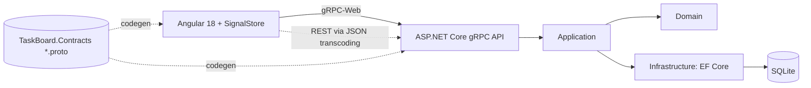

# TaskBoard – .NET 8 gRPC API + Angular 18 (SignalStore)
A learning project: a small Kanban-style **TaskBoard** built to practice **gRPC on .NET 8** and **Angular 18 with NgRx SignalStore**.
It is a study project, not production software.

## What it demonstrates
- Contract-first design with Protocol Buffers (`.proto` files as the single source of truth)
- gRPC unary calls (CRUD) and **server streaming** (live board updates)
- **gRPC-Web** so a browser client can talk to a gRPC server
- **gRPC JSON transcoding**: the same services exposed as REST + Swagger, for a gRPC vs REST comparison
- EF Core with **SQLite** and migrations
- Cross-cutting concerns: interceptors, gRPC status codes, validation, deadlines
- Angular standalone components with **NgRx SignalStore** (`withEntities`, `rxMethod`, optimistic updates)

## Tech stack
| Area | Technology |
|---|---|
| API | .NET 8, ASP.NET Core gRPC, Grpc.AspNetCore.Web |
| Data | EF Core + SQLite |
| Client | Angular 18.2, Angular Material, `@ngrx/signals` 18.x |
| gRPC client | `@protobuf-ts/grpcweb-transport` |
| Tooling | Node 20, npm 10, `dotnet-ef`, `grpcurl` / `grpcui` |

## Architecture


Planned layout (monorepo, client and server are independent projects):

```
src/
  TaskBoard.Contracts/      # .proto files
  TaskBoard.Api/            # gRPC services, interceptors, gRPC-Web, transcoding
  TaskBoard.Application/    # use cases, mapping, validation
  TaskBoard.Domain/         # entities
  TaskBoard.Infrastructure/ # DbContext, migrations
client/
  taskboard-web/            # Angular app
TaskBoard.sln
```

## Getting started
_Filled in as the project takes shape._

```bash
# API
dotnet run --project src/TaskBoard.Api

# Client
cd client/taskboard-web
npm install
ng serve
```

## Roadmap
- [ ] 0. Repository setup (.gitignore, README)
- [ ] 1. Solution and Angular skeleton, CORS + gRPC-Web
- [ ] 2. Proto design (`taskboard.v1`)
- [ ] 3. Backend CRUD with EF Core + SQLite migrations
- [ ] 4. Interceptors, error handling, deadlines
- [ ] 5. Angular foundation and generated gRPC clients
- [ ] 6. State management with SignalStore
- [ ] 7. Server streaming (`WatchBoard`)
- [ ] 8. REST comparison via JSON transcoding
- [ ] 9. Optional: JWT auth, PostgreSQL/Docker, client and bidirectional streaming, tests

## License
MIT – see [LICENSE](LICENSE).
